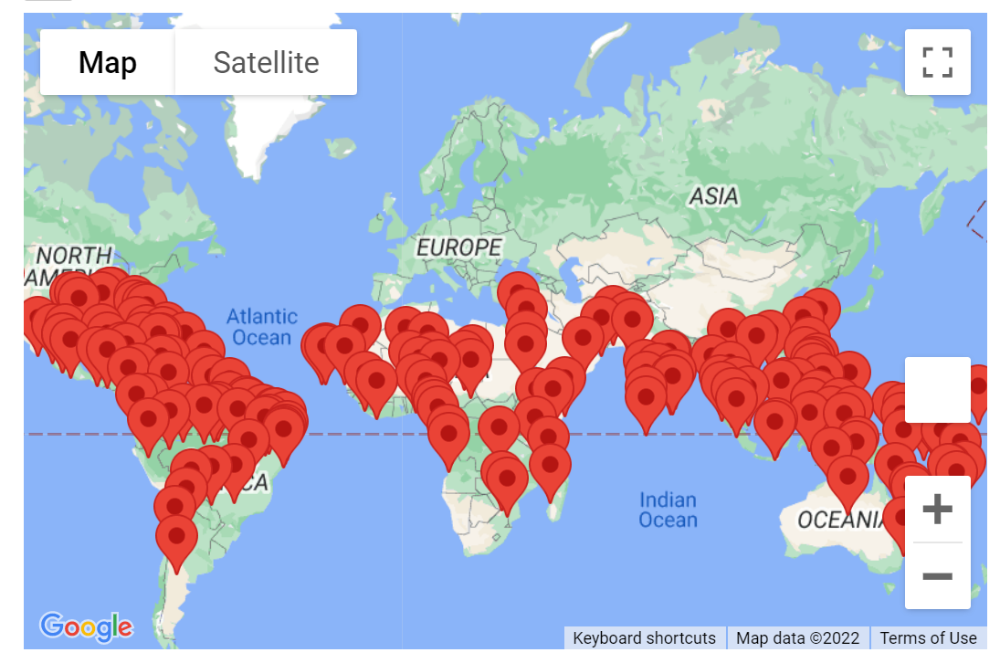
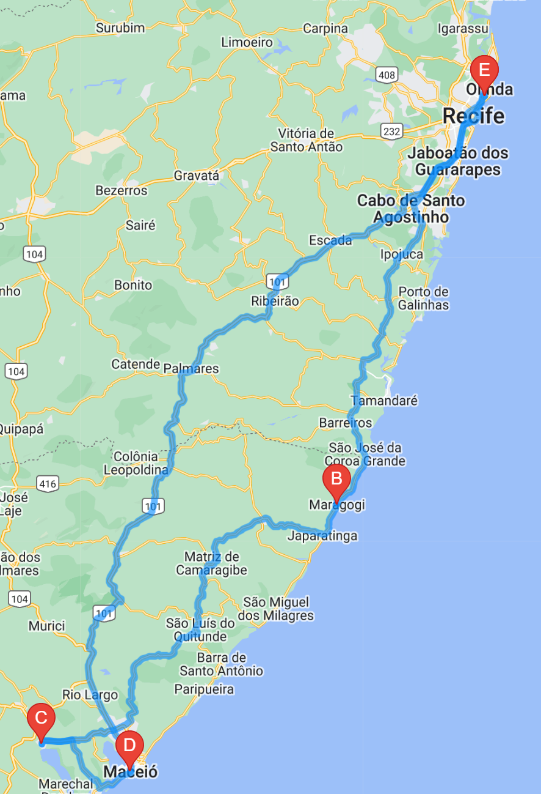
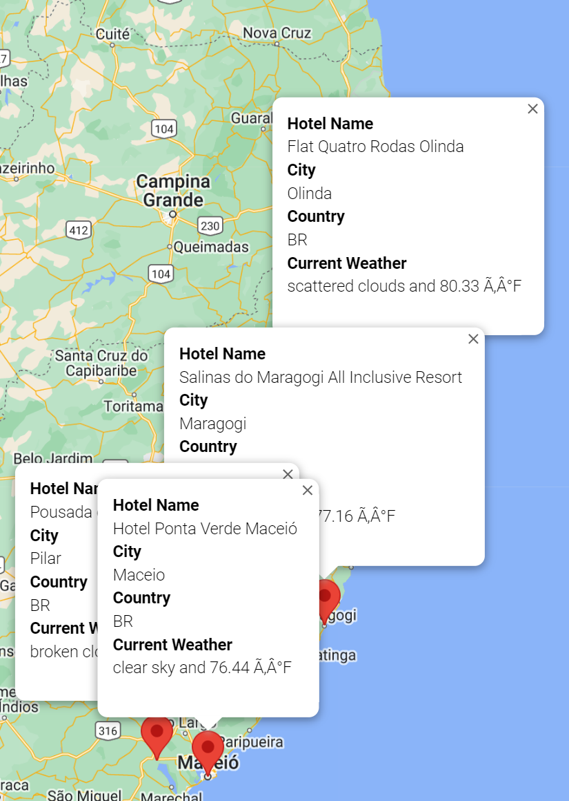

# World_Weather_Analysis

## Purpose

OpenWeatherMap allowed performance of an API call which generated 2,000 cities globally. Current weather standings (temperature, humidity, cloudiness, wind speed, fog, rain, etc.) longitude and latitude are all viewable. I then inputed my clients temperature preference, from there the cities with the corresponding temperatures were rendered. My client then chose which country to travel to. I was then able to create a new dataframe encompassing the hotels, temperature, country, and city iformation. The client selected four cities within one country, allowing me to create a vacation itinerary. Using Google's Directions API, a route for driving was illustrated. My client now has access to the route map, hotel information, current temperature, country, and city at their fingertips.

## Results

### 2,000 Cities Rendered Globally

## Route of Four Cities

## Hotel, Temperature, Country, and City Marked

## Summary

Selection of desired vacation destinations of 2,000 cities globally are able to be chosen by client. Current weather standings, hotel suggestion, route, country, and city are all viewable by a marker. 
